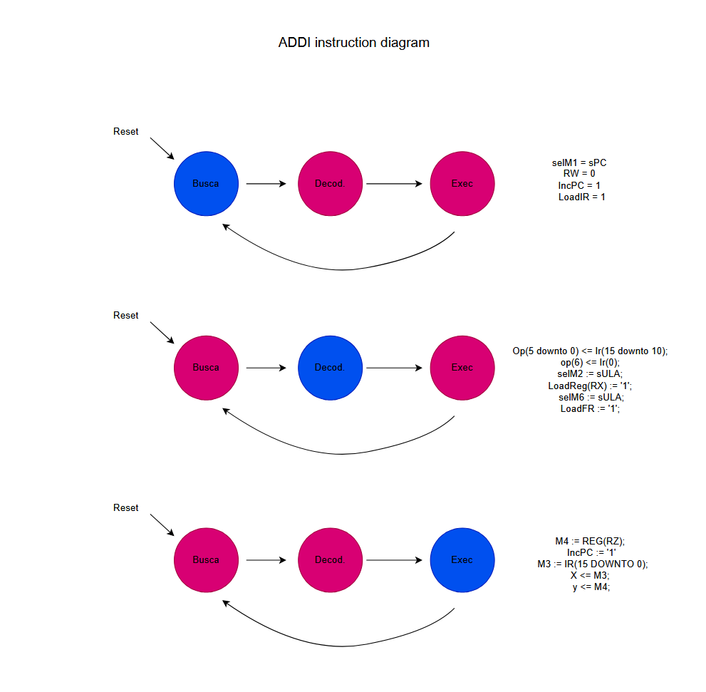

# SIMAS BOMBER!

Projeto criado para a disciplina de Prática em Arquitetura e Organização de computadores.

Comtém a implementação da CPU do ICMC, e uma instrução adicional na pasta cpu_instr_nova e a implementação de um jogo em assembly baseado em bomberman e suas mecanicas. Além disso foi confeccionado um criado de mapas para este jogo, que esta presente na pasa map_creator, clicando na pasta build e index.html.

## Processador

Conforme instruído nas aulas, foram implementadas no processador as funções
descritas pelo professor Simões (e presentes no arquivo Figma) relativas ao 
processador. A implementação se deu em VHDL, e o hardware foi testado com
sucesso em FPGAs. Além disso, foi teorizada a implentação da instrução addi, cujo intuito é a adição do valor de uma registradora e um numero.
Segue abaixo o um diagrama que ditaria sua implementção.

## Videogame

O jogo consiste em 2 players, sendo o objetivo eliminar o adversário através 
das explosões. O jogador pode posicionar bombas para destruir obstáculos os quais possuem a chance de conter powerups para ajuda-lo.
O game possui 4 estados: tela inicial, de comandos, de game-over, e de gameplay. O video do jogo funcionando segue no link abaixo:

https://youtu.be/sF_6yX_AmvQ?si=HM3s2CukW_GztfYw

## Código

O a implementação do jogo esta contida principalmente na pasta jogo_asm. Nela estão separados em arquivos os principais sistemas que compoem o jogo.

O sistema principal do jogo é a tile map. A tile map é a forma em que os objetos do jogo comunicam entre si. Ele permite o acesso simples de diferentes valores no mapa com base em um sistema de coordenas cartesianas, facilitando a implementação de outras funções de objetos que interagem entre si, como, por exemplo, o jogador e a parede, em que a parede inibe o movimento do jogador para aquela posição do mapa. O tile map também permite implementar o sistema de criação de mapas, que, portanto, permite uma variade maior 
de coisas para os players interagirem.

tem umas outras coisas ai ...

## Créditos

- Murilo Leandro Garcia
- Vitor Daniel Resende 
- João Daleffe Dias
- Renan Banci Catarin, 14658181
- Vinicius de Souza Freitas, 15491959
- Glauco Fleury Corrêa de Moraes
- Rodrigo Silva de Almeida, 15645380
